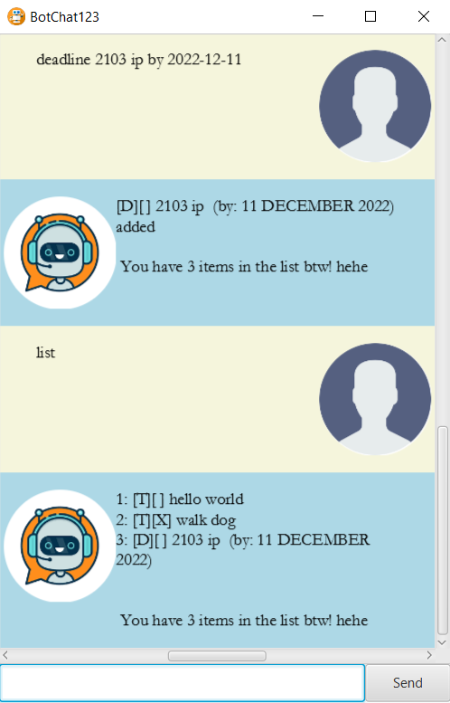

# BotChat123 User Guide

BotChat123 is a desktop task management system to use for your day to day tasks. Manage your work and keep your tasks organized with BotChat123!

## Table of Contents
1. [Set-Up](#set-up)
2. [Features](#features)
    - [Add Todo task](#add-todo-task)
    - [Add Deadline task](#add-deadline-task)
    - [Add Event task](#add-event-task)
    - [List tasks](#list-tasks)
    - [Find tasks](#find-tasks)
    - [Delete task](#delete-task)
    - [Mark task](#mark-task)
    - [Unmark task](#unmark-task)
    - [Accessing Deleted Data](#accessing-deleted-data)
    - [Saving data](#saving-data)
    - [Editing saved data](#editing-saved-data)
3. [FAQ](#faq)
4. [Summary](#summary)

## Set-Up
1. Ensure you have Java 11 or above installed in your Computer.

2. Download the latest BotChat.jar from [here](https://github.com/eugenetayyj/ip/releases).

3. Copy the file to the folder you want to use as the home folder for your BotChat.

4. Double-click the file to start the app. The GUI similar to the below should appear in a few seconds. Note how the app contains some sample data.



5. Type the command in the command box and press Enter to execute it.
Some example commands you can try:

    - `list` : Lists all contacts.
    - `mark 1` : Marks Task 1.
    - `delete 3` : Deletes Task 3 shown in the current list.
    - `bye` : Exits the app.

Refer to the [Features](#features) below for details of each command.

## Features 
<!-- <div markdown="block"> -->

**Note about the command format:**<br>

- Command formats are to be followed **strictly**.
<br>
- `[]` denotes an input given by the user. 
eg. For a deadline, `deadline [Task Name] by [Date]`, `[Task Name]` and `[Date]` is given by the user which can be `deadline Submit Resume by 2022-11-11`.
<br>

- Dates should be in the following format: `YYYY-MM-DD`. 
eg. If a user wants to input 14 September 2022, the corresponding input is `2022-09-14`.
<br>

- Extraneous parameters for commands that do not take in parameters (such as list, bye and sort) are not allowed.
e.g. If the command specifies list 123, it will be interpreted as list.

<!-- </div> -->

### Add `Todo` Task

Creates a todo task that tracks a task that has to be completed.<br>

Format: `todo [Task Name]`

Examples:<br>

- `todo walk dog`
- `todo watch She-Hulk`

### Add `Deadline` Task

Creates a deadline task that tracks a task and the date that it has to be completed by.<br>

Format: `deadline [Task Name] by [Date]`<br>

Tips:

- `[Date]` has to be in the format YYYY-MM-DD.
eg. If a user wants to input 14 September 2022, the corresponding input is `2022-09-14`.
<br>
- `by` should be between the `[Task Name]` and `[Date]` for the input of deadline task to be read correctly. 

Examples:<br>

- `deadline CS2103T IP by 2022-11-12`
- `deadline Do Resume by 2022-01-05`

### Add `Event` Task

Creates a event task that tracks a task and the date that it is on.<br>

Format: `event [Task Name] at [Date]`<br>

Tips:

- `[Date]` has to be in the format YYYY-MM-DD.
eg. If a user wants to input 14 September 2022, the corresponding input is `2022-09-14`.
<br>
- `at` should be between the `[Task Name]` and `[Date]` for the input of event task to be read correctly. 

Examples:<br>

- `event Concert at 2022-08-12`
- `event Interview at 2022-01-05`

### `List` Tasks

Lists out all the tasks that has been saved in the list.

Format: `list`

Tips:

- List does not take in extraneous inputs. Any of such inputs will be ignored.
<br>

Examples:<br>
- Input: `list`
- Output: 

### `Find` Task

Finds tasks whose Task Name matches the search.

Format: `Find [Keyword]`

Tips:

- Find will searches by sequence. If a `[Task Name]` contains matching sequence of characters as `[Keyword]` it can be found.
<br>

Examples:<br>
- Input: `Find help`
- Output: 

### Feature-XYZ

Description of the feature.

## Usage

### `Keyword` - Describe action

Describe the action and its outcome.

Example of usage: 

`keyword (optional arguments)`

Expected outcome:

Description of the outcome.

```
expected output
```
